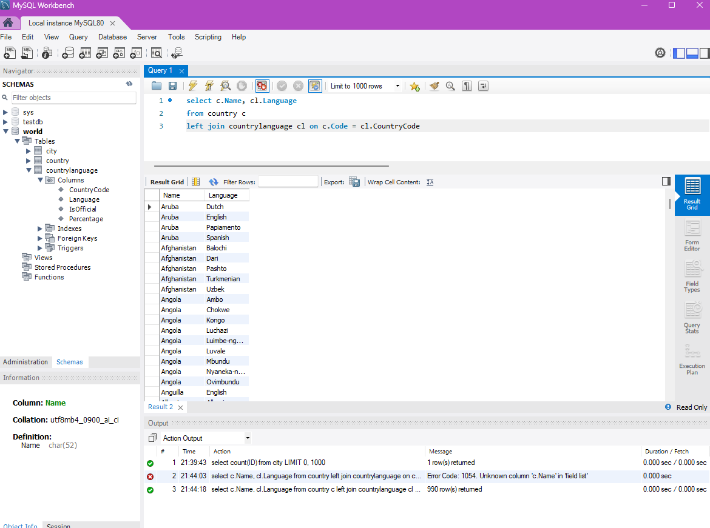
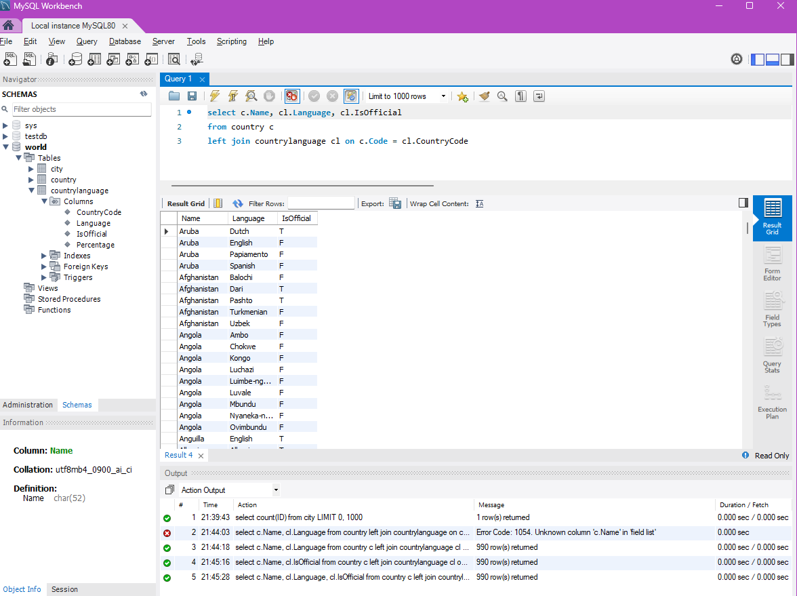
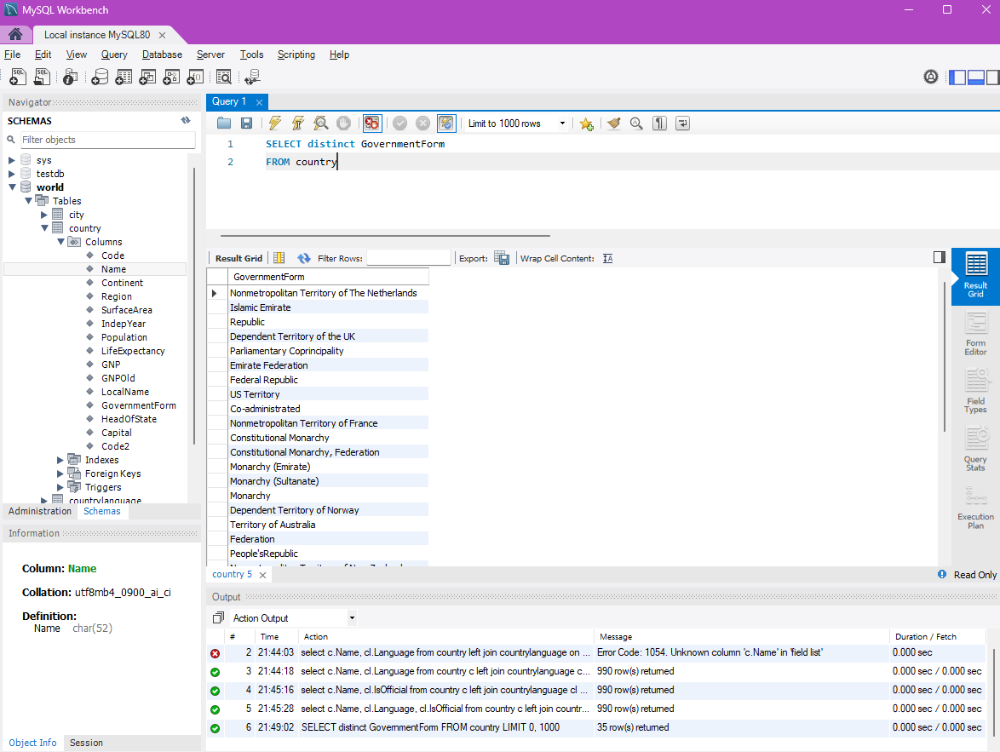
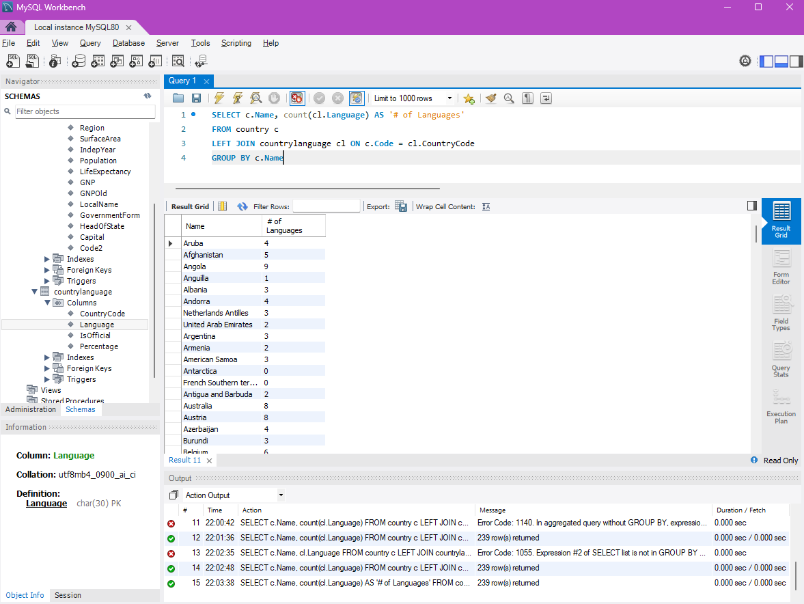
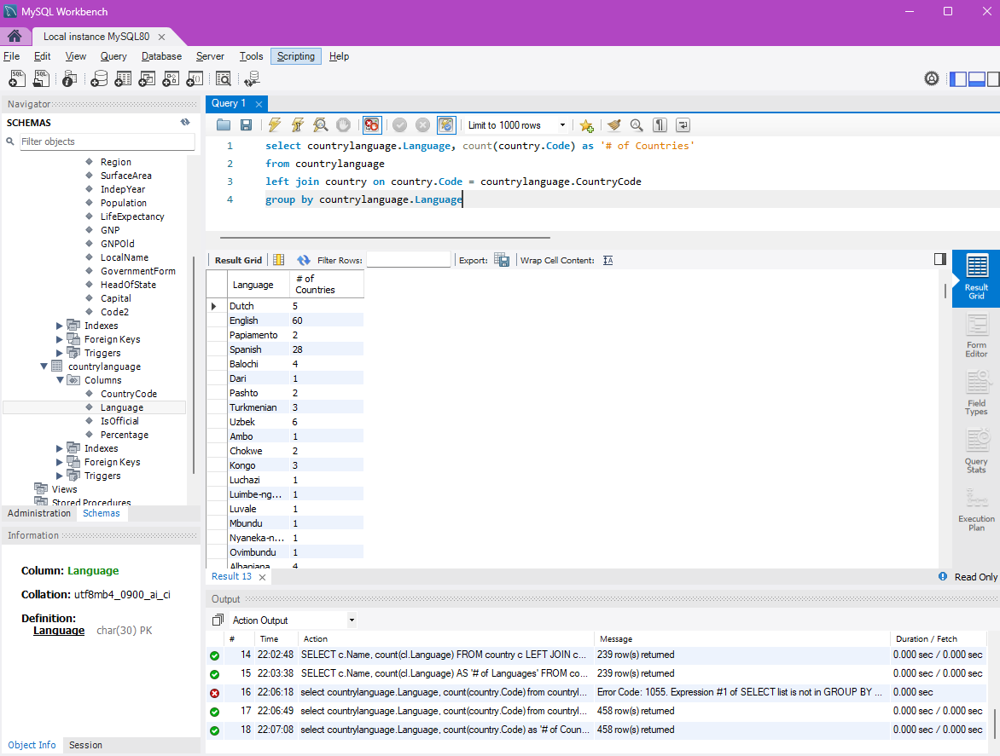
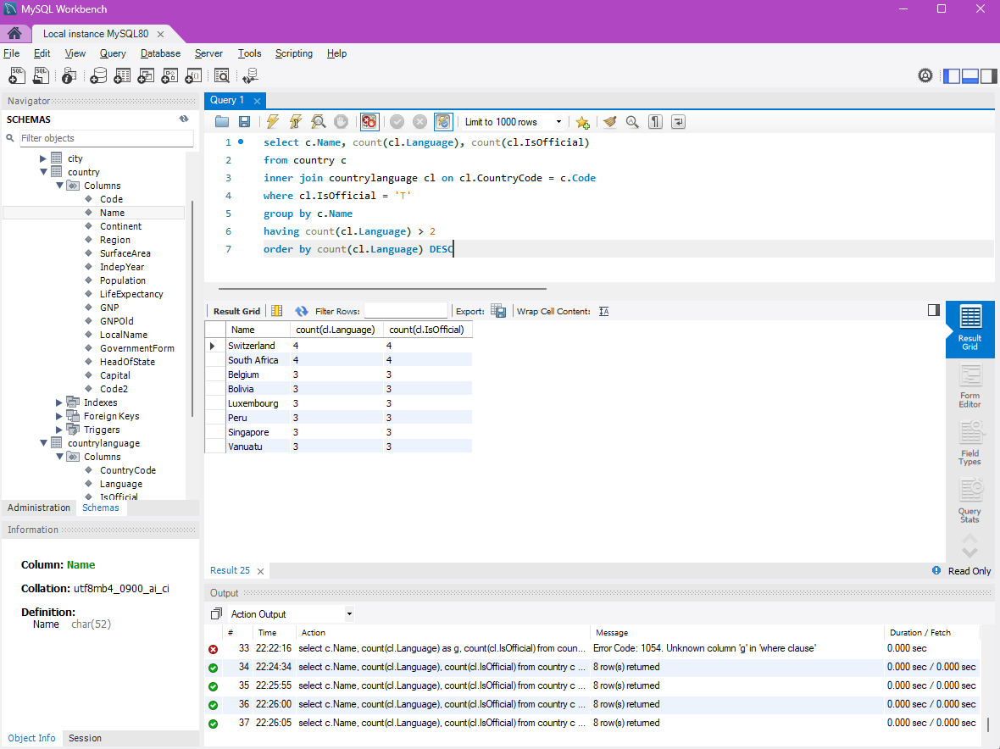

# Exercise 02: World Database – Joins, Grouping, and Data Quality

- Name: Caleb Sellinger
- Course: Database for Analytics
- Module: 2
- Database Used: World Database (PostgreSQL)

---

## Instructions

- Answer each question below using SQL executed against the **World database**.
- All SQL commands **must be run by you**.
- For each SQL-based question:
  - Include the SQL command in a fenced code block
  - Include a **screenshot** showing the command and its results
- Store screenshots in the `screenshots/` folder and embed them below each answer.

---

## Question 1

When importing records from `worldPGSQL.sql`, **how many cities were imported**?

### Answer
4079

### Screenshot

```sql
select count(ID)
from city
```


---

## Question 2

Using the World database, write the SQL command to **display each country name along with the name of each language spoken in that country**.

### SQL

```sql
select c.Name, cl.Language
from country c
left join countrylanguage cl on c.Code = cl.CountryCode
```

### Screenshot



---

## Question 3

Using the World database, write the SQL command to **display each country name along with the name of each official language spoken in that country**.

### SQL

```sql
select c.Name, cl.Language, cl.IsOfficial
from country c
left join countrylanguage cl on c.Code = cl.CountryCode
```

### Screenshot



---

## Question 4

Consider the following two SQL statements:

```sql
SELECT *
FROM country, countrylanguage
WHERE country.code = countrylanguage.countrycode;
```

```sql
SELECT *
FROM country
LEFT OUTER JOIN countrylanguage
ON country.code = countrylanguage.countrycode;
```

**In your own words**, describe what data the **second query returns that the first query does not**.

### Answer

The second query only selects non-matching records from the country table.

---

## Question 5

Using the World database, write the SQL command to **list all different forms of government** found in the data.
Do **not** repeat any form of government more than once.

### SQL

```sql
SELECT distinct GovernmentForm
FROM country
```

### Screenshot



---

## Question 6

Using the World database, write the SQL command to **list all names of cities and countries in one column**.
Label the column **"City or Country Name"**.

### SQL

```sql
SELECT concat(city.Name,', ',country.Name) AS 'City or Country Name'
FROM city
INNER join country on country.Code = city.CountryCode
```

### Screenshot


---

## Question 7

Using the World database, write the SQL command to **list all countries by name**, along with the **number of languages spoken in each country**.
Be sure to **sort by country name**.

### SQL

```sql
SELECT c.Name, count(cl.Language) AS '# of Languages'
FROM country c
LEFT JOIN countrylanguage cl ON c.Code = cl.CountryCode
GROUP BY c.Name
```

### Screenshot



---

## Question 8

Using the World database, write the SQL command to **list all languages**, along with the **number of countries where each language is spoken**.
Be sure to **sort by language name**.

### SQL

```sql
select countrylanguage.Language, count(country.Code) as '# of Countries'
from countrylanguage
left join country on country.Code = countrylanguage.CountryCode
group by countrylanguage.Language
```

### Screenshot



---

## Question 9

Using the World database, write the SQL command to **list countries that have more than two official languages**, along with the **number of official languages spoken**.

*Hint: There are 8 such countries in this dataset.*

### SQL

```sql
select c.Name, count(cl.Language), count(cl.IsOfficial)
from country c
inner join countrylanguage cl on cl.CountryCode = c.Code
where cl.IsOfficial = 'T'
group by c.Name
having count(cl.Language) > 2
order by count(cl.Language) DESC
```

### Screenshot



---

## Question 10

Using the World database, write the SQL command to **find cities where the district value is missing**.

*Hint: Use `LIKE` and the dash (`-`) since some rows use that instead of actual data.*

### SQL

```sql
select c.Name, c.District
from city c
where c.District like '–' or c.District = null or c.District = ''
```

### Screenshot


---

## Question 11

Using the World database, write the SQL command to **calculate the percentage of cities with missing district values**.

*Hint: The result should be approximately 0.4%.*

### SQL

```sql
select count(case when District like '–' or District = '' then 1 end)*100/ count(ID)
from city
```

### Screenshot


