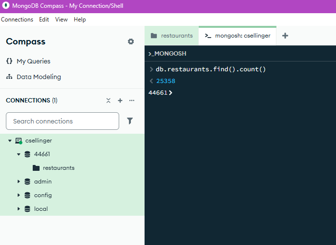
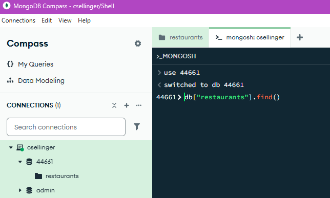
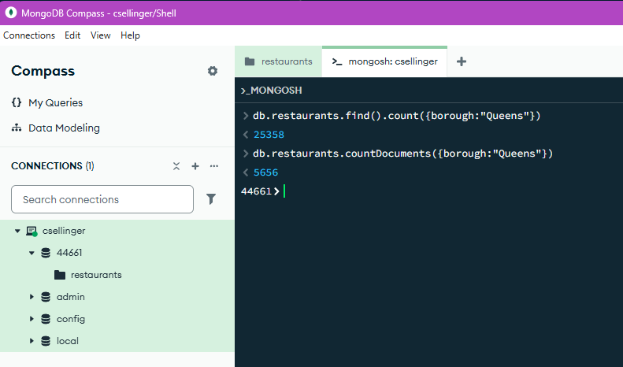
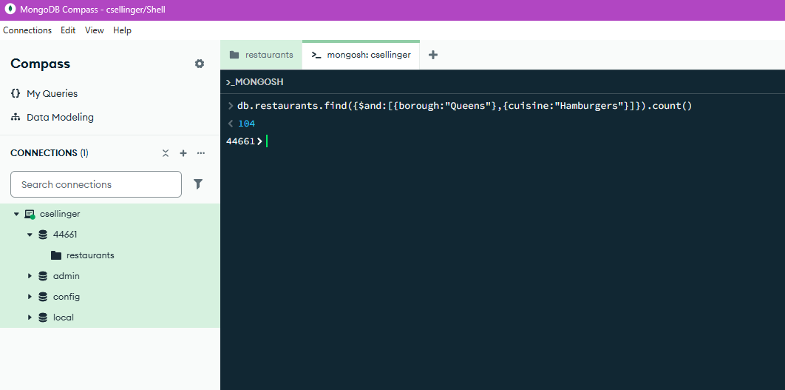
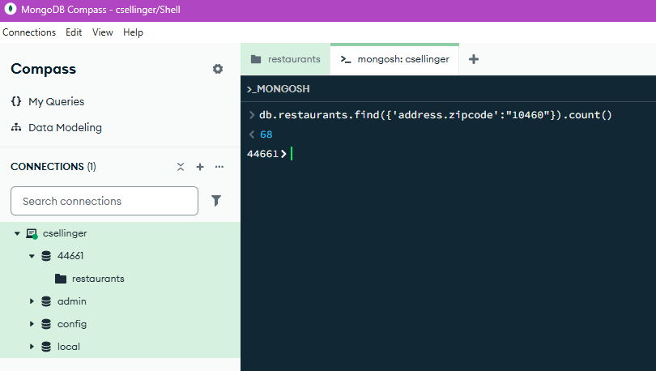
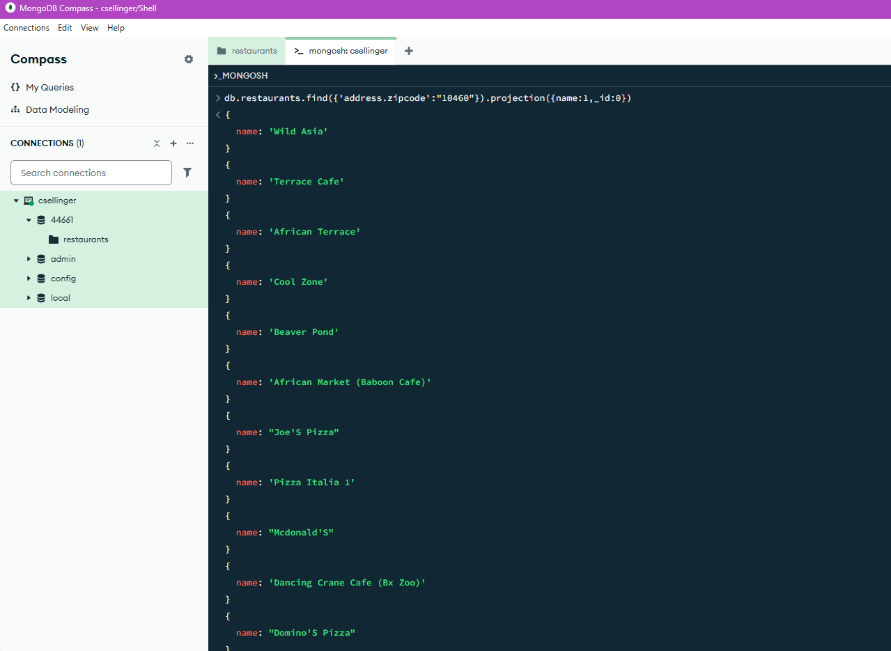
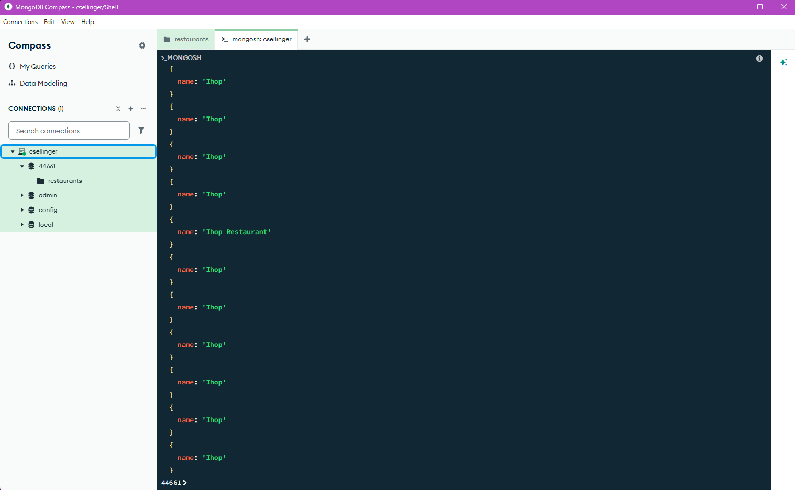

# Exercise 03: MongoDB – Document Queries and Analysis

- Name: Caleb Sellinger
- Course: Database for Analytics
- Module: 3
- Database Used: MongoDB
- Dataset: `restaurants-json.json`

---

## Instructions

- Import the provided `restaurants-json.json` file into MongoDB.
- All commands must be **executed by you** in the MongoDB shell or MongoDB Compass.
- For each query:
  - Include the MongoDB command in a fenced code block
  - Include a **screenshot** showing the command and its result
- Store screenshots in the `screenshots/` folder and embed them below each answer.

---

## Question 1

When importing the documents from `restaurants-json.json`, **how many documents were imported into your collection**?

### Answer
25358

### Screenshot
_Show evidence of how you determined this (for example, a count query)._

```javascript
db.restaurants.find().count()
```

!

---

## Question 2

Before writing queries on the data, **what command do you use to set the MongoDB shell to operate on the `44661` database**?

### MongoDB Command

```javascript
use 44661
```

Although clicking the Open MongoDB shell button in the top right automatically connects the shell to use whatever database your in.


### Screenshot



---

## Question 3

Using your `restaurants` collection in the `44661` database, write the MongoDB query needed to **locate all documents in the `"Queens"` borough**.

### MongoDB Query

```javascript
db.restaurants.find({borough:"Queens"})
```

### Screenshot


---

## Question 4

Using your `restaurants` collection in the `44661` database, write the MongoDB query needed to **find the number of restaurants in the `"Queens"` borough**.

### MongoDB Query

```javascript
db.restaurants.countDocuments({borough:"Queens"})
```

### Screenshot



---

## Question 5

Using your `restaurants` collection in the `44661` database, write the MongoDB query needed to **find the number of restaurants in the `"Queens"` borough whose cuisine is `"Hamburgers"`**.

### MongoDB Query

```javascript
db.restaurants.find({$and:[{borough:"Queens"},{cuisine:"Hamburgers"}]}).count()
```

### Screenshot



---

## Question 6

Using your `restaurants` collection in the `44661` database, write the MongoDB query needed to **find the number of restaurants in Zipcode `10460`**.

*Hint: Look up how to query **embedded documents**.*

### MongoDB Query

```javascript
db.restaurants.find({'address.zipcode':"10460"}).count()
```

### Screenshot



---

## Question 7

Using your `restaurants` collection in the `44661` database, write the MongoDB query needed to **display only the names of restaurants in Zipcode `10460`**.

*Hint: Look up how to **project fields** in MongoDB.*

Your output should resemble:

```
{ name: "Wild Asia" }
{ name: "Terrace Cafe" }
{ name: "African Terrace" }
{ name: "Cool Zone" }
{ name: "Beaver Pond" }
...
```

### MongoDB Query

```javascript
db.restaurants.find({'address.zipcode':"10460"}).projection({name:1,_id:0})
```

### Screenshot



---

## Question 8

Using your `restaurants` collection in the `44661` database, write the MongoDB query needed to **display only the names of restaurants whose name contains `"IHOP"`**, ignoring case.

Your results should include:
- `"Ihop"`
- `"Ihop Restaurant"`

### MongoDB Query

```javascript
db.restaurants.find({name:{$regex:"IHOP",$options:"i"}}).projection({name:1,_id:0})
```

### Screenshot



