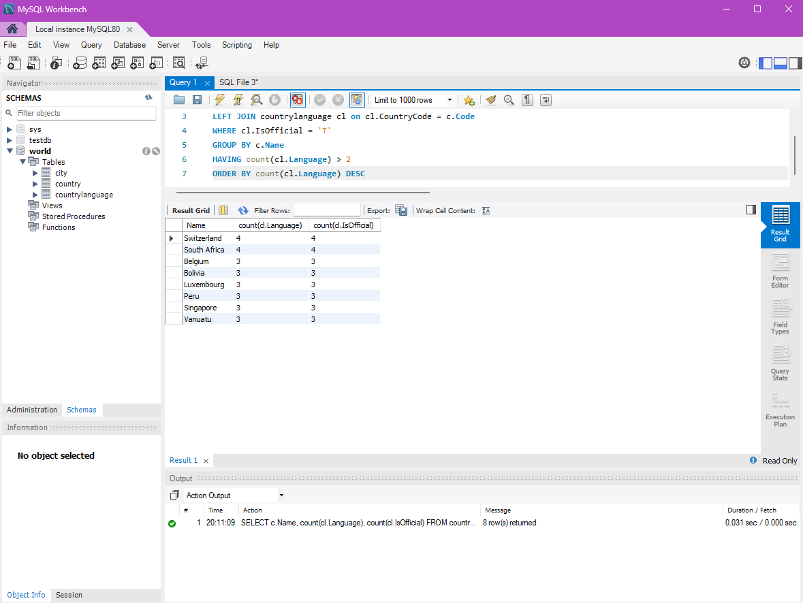
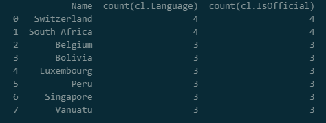

# Exercise 04: Advanced SQL, Jupyter, and Visualization

- Name: Caleb Sellinger
- Course: Database for Analytics
- Module: 4
- Database Used: World Database
- Tools Used: PostgreSQL, SQLAlchemy, Pandas, Jupyter Notebooks

---

## Instructions

- Complete each task using the **World database** installed earlier.
- For SQL questions:
  - Write the SQL command in a fenced code block
  - Execute the command and include a **screenshot of the results**
- For Jupyter Notebook questions:
  - Include the required Python statements
  - Include **screenshots of the notebook output**
- Store all screenshots in the `screenshots/` folder and embed them below each question.

---

## Question 1

Considering the World database, write a SQL statement that will **display the names of countries that speak more than two official languages**, along with the **number of official languages spoken**.

- Sort the results by **number of languages**, from **most to least**.
- *Hint: There are fewer than 10 countries in the results.*

### SQL

```sql
SELECT c.Name, count(cl.Language), count(cl.IsOfficial)
FROM country c
LEFT JOIN countrylanguage cl on cl.CountryCode = c.Code
WHERE cl.IsOfficial = 'T'
GROUP BY c.Name
HAVING count(cl.Language) > 2
ORDER BY count(cl.Language) DESC
```

### Screenshot



---

## Question 2

Using **Jupyter Notebooks**, you must use the `create_engine` command to connect to your database.

After the `create_engine` command is executed, **what are the three statements required to execute the query from Question 1 and display the results in the notebook**?

### Python Code

```python
sql_statement = """SELECT c.Name, count(cl.Language), count(cl.IsOfficial)
FROM country c
LEFT JOIN countrylanguage cl on cl.CountryCode = c.Code
WHERE cl.IsOfficial = 'T'
GROUP BY c.Name
HAVING count(cl.Language) > 2
ORDER BY count(cl.Language) DESC"""

df = pd.read_sql_query(sql_statement, engine)
print(df.head()) # Or df if you want the whole dataframe
```

### Screenshot



---

## Question 3

Using **Jupyter Notebooks**, write the Python code needed to produce the following graph:


(The graph shows country-level results derived from the World database.)

### Python Code

```python
# Display graph of results
import matplotlib.pyplot as plt

# plot for bar graph of results
plt.figure(figsize=(10, 6)) # so that x labels aren't smooshed together
plt.bar(df['Name'], df['count(cl.Language)'])
plt.xlabel('Country Name')
plt.ylabel('Number of Official Languages')
plt.title('Countries with More Than 2 Official Languages')
```

### Screenshot


